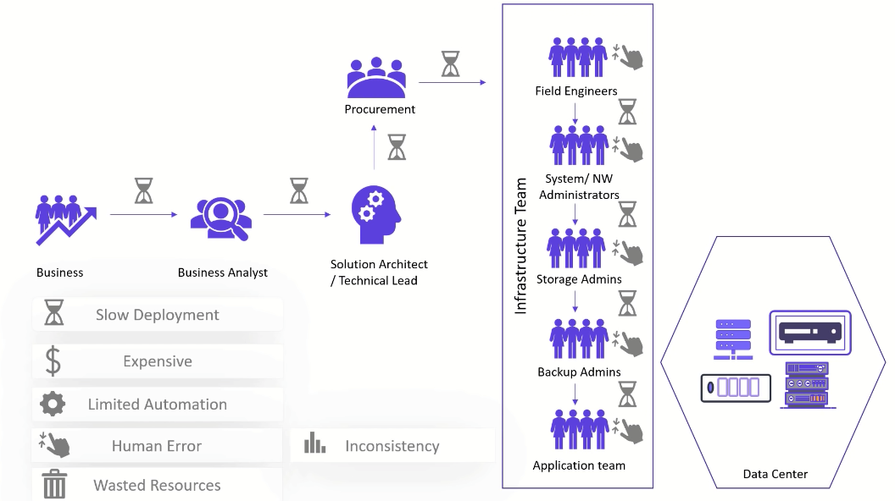
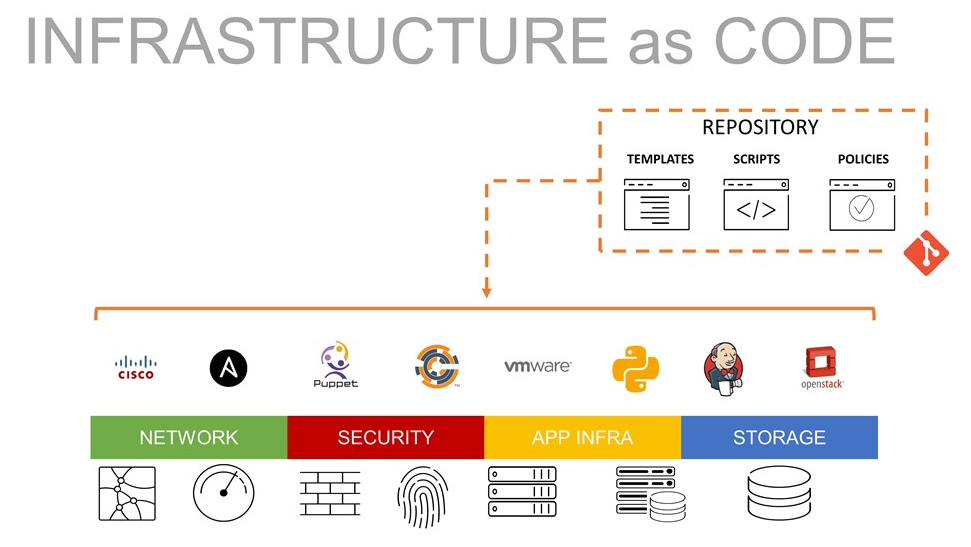
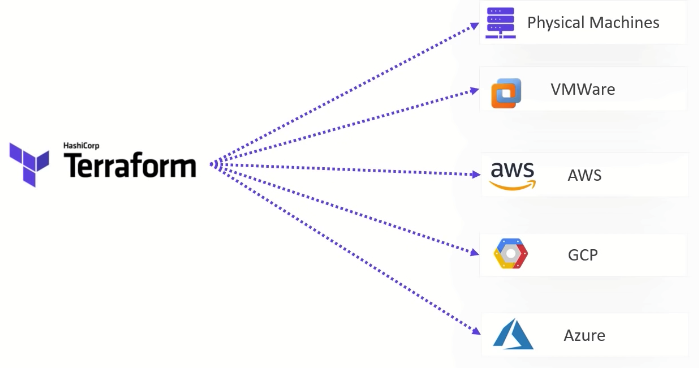

# terraform-guide

terraform-guide

<br>

## 강의 소개

Terraform 을 입문하는 개발자를 대상으로 Terraform 을 이해하고 프로비저닝 환경을 구성하고 간단한 실습 및 과제를 통해 보다 심도있는 이해를 목적으로 합니다.  
Workspace 를 통한 대규모 프로젝트 관리에 대한 개요와 아주 작은 모듈화를 구현하는 실습을 통해 Terraform 을 응용하는 방법을 배웁니다.

<br>

## Before IaC

Cloud 와 IaC 가 있기 전에는 애플리케이션 서비스를 Legacy Data-Center 에 Spin-Up 하기 위해서 여러사람의 합의 및 의사 결정, 절차, 환경 등 많은 어려움이 있었습니다.



- [Cloud 컴퓨팅 참고](https://ko.wikipedia.org/wiki/%ED%81%B4%EB%9D%BC%EC%9A%B0%EB%93%9C_%EC%BB%B4%ED%93%A8%ED%8C%85)
- [IaC 참고](https://en.wikipedia.org/wiki/Infrastructure_as_code)

<br>

## Infrastructure as Code(IaC) 소개



클라우드 환경에서 리소스를 스핀-업 하려면 클라우드가 제공하는 관리 콘솔에 로그인하여 원하는 리소스 생성 관련 화면을 통해 주요 정보를 입력 및 생성 버튼을 클릭하고 나서야 인스턴스를 실행 할 수 있습니다.  
위와 같이 사용자가 관리콘솔에서 행해지는 작업들을 동일하게 코드로 구현에 내는것이 바로 인프라의 자동화 입니다.

<br>

### IaC 의 장점

- 가독성: 개발자가 이해하기 쉬운 고-수준의 프로그래밍 언어로 제공 됩니다.
- 비용 절감: 클라우드에 숙련된 전문가가 필요하지 않습니다.
- 배포 속도 향상: 코드로 정의한 스펙을 기반으로 빠른 프로비저닝을 보장 합니다.
- 오류 감소: 코드로 정의한 스펙을 기반으로 사람의 실수를 방지하거나 누락되거나 잘못된 설정읠 쉽고 빠르게 보완할 수 있습니다.
- 인프라 일관성 향상 (Idempotent): 코드로 정의한 스펙은 클라우드 계정 / 리전에 동일하게 프로비저닝 됩니다.
- 구성 변동 제거: Git 과 같은 소스 버전 컨트롤을 통해 리소스 구성에 대한 임의적인 변경을 통제 합니다.

<br>

### Why Terraform



- Provider Rich: Terraform에는 API를 통해 여러 클라우드 CSP 뿐만 아니라 많이 사용되는 오픈소스 서비스를 대상으로 리소스를 생성하는 'Provider'가 있습니다.
- DevOps 방법론: Terraform을 사용하여 안전하고 안전한 방식으로 버전 제어, 코드 검토, 지속적인 통합, 자동화된 테스트 및 지속적인 배포와 같은 DevOps 모범 사례를 따를 수 있습니다.
- 사용이 간편함: Terraform은 선택하고 배우기에 매우 쉬운 도구입니다. 방대한 온라인 커뮤니티와 존재는 말할 것도 없고 문서가 풍부하고 따라하기 쉽기 때문에 입문하는 데 몇일이면 충분합니다.
- 자체 문서화: Terraform 사용의 한 가지 이점은 코딩된 내용을 쉽고 명확하게 따를 수 있도록 거의 자체적으로 선언된 리소스/모듈로 문서화한다는 것입니다.
- 클라우드 불가지론적: Hashicorp는 다양한 CSP 의 API가 다르기 때문에 모든 CSP 를 지원하는 IaC 도구로 Terraform이 클라우드 불가지론적이라고 주장합니다.
- Module: 여러 리소스를 그룹화하여 재사용 가능하도록 모듈로 생성할 수 있고 이를 통해 동일한 템플릿으로 쉽게 서비스를 프로비저닝 할 수 있습니다.
- State: Terraform 리소스가 생성되면 플랫폼 내에서 추적 및 관리되는 해당 리소스에 대한 상태 파일이 생성됩니다. 이를 통해 REAL 환경과 구성상의 차이를 식별하고 동기화 할 수 있습니다.
- Workspace: 작업 공간은 Terraform 코드를 논리적 그룹으로 구성하는 방법입니다. 예를 들어 네트워크, 서버 및 애플리케이션을 다른 상태 파일로 분할합니다.

<br><br>

# Practice

Code 를 직접 구현 하며 Terraform 의 실제 동작을 이해하고 주어진 문제를 해결해 가는 과정에서 효과적인 Solutions Architecture 를 고민하고 구현을 통해 개발 역량을 높이기 위함입니다.

<br>

## Lab 101: 프로비저닝 환경 구성

[Terraform 설치](./lab-101/guide.md)
[CloudFormation](./lab-101/cloudformation.md)

[CloudFormation](./lab-101/cloudformation.md)

<br>

## Lab 102: Terraform Basic

Terraform의 기초를 이해 합니다.

- [Basic](./lab-102/guide.md)
- [Basic HandsOn](./lab-102/practice/handson.md)

<br>

## Lab 103:Terraform State 소개

Terraform Code - `tfstate` - REAL Infrastructure 를 이해 합니다.

- [terraform.tfstate](./lab-103/guide.md)
- [Question](./lab-103/practice/handson.md)

<br>

## Lab 201: Terraform 프로젝트 구성

Terraform 프로젝트 레이아웃 및 구성이 복잡한 프로젝트를 위한 테라폼 프로비저닝 전략을 소개 합니다.

- [Terraform Project](./lab-201/guide.md)
- [Project HandsOn](./lab-201/practice/handson.md)

<br>

## Lab 202: 아키텍처 설계

- [diagrams.net](https://www.diagrams.net/) 을 통해 클라우드 아키텍처 다이어그램을 작성 합니다.
- [Architecture Design HandsOn](./lab-202/practice/handson.md)

<br>

## Lab 203: apple 프로젝트 구현

- [apple](lab-203/practice/handson.md) 테라폼 프로젝트를 구현 합니다.

<br>

## Meta-Arguments 이해와 모듈화

Meta-Arguments 를 이해 하고 모듈화 및 자동화에 응용할 수 있습니다.

<br>

### depends_on

Terraform 은 의존적인 리소스가 먼저 생성되어야 하는 경우 depends_on 을 통해 정의 합니다. 반면 독립적인 리소스는 병렬로 프로비저닝 됩니다.

```hcl
resource "aws_instance" "ec2" {
  ami = "ami-a1b2c3d4"

  depends_on = [
    aws_iam_role_policy.policy
  ]
}
```

<br>

### count

resource 블록은 기본적으로 하나의 인스턴스 개체만 프로비저닝 합니다.   
count 는 선언된 숫자 만큼 resource 블럭을 반복 합니다.

```hcl
resource "aws_instance" "ec2" {
  count = 3
  ami   = "ami-a1b2c3d4"
}
```

위와 같이 하게되면 3 개의 ec2 인스턴스가 프로비저닝 됩니다. 

<br>

### for_each

for_each 는 문자열 컬렉션을 통한 반복 블럭을 정의 합니다. count 와 유사하지만 resource 반복 및 부분 반복을 지원 합니다.

```hcl
resource "aws_instance" "ec2" {
  for_each = toset(["web", "app", "batch"])
  name     = each.key
  ami      = "ami-a1b2c3d4"
}
```


<br>

### lifecycle

lifecycle 는 다음의 프로비저닝 과정을 컨트롤 할 수 있습니다. 

- 리소스 생성
- 리소스 삭제 
- 갱신된 리소스
- 기존 리소스를 삭제하고 새로 생성하여 리소스 업데이트

#### ignore_changes
`resource` 가 가지는 속성에 대해 변경 사항이 생기더라도 tfstate 상태 정보의 동기화 대상에서 제외 합니다.  

example ec2 인스턴스에 대해 tag, ami 속성이 변경되더라도 프로비저닝 동기화를 하지 않습니다.   

```hcl
resource "aws_instance" "example" {
  lifecycle {
    ignore_changes = [
      tags,
      ami
    ]
  }
}
```

#### create_before_destroy
```hcl
resource "aws_instance" "example" {

  lifecycle {
    create_before_destroy = true
  }
}
```
example ec2 인스턴스를 apply 할 때 REAL 인프라를 먼저 삭제하고 생성 합니다. 

##### prevent_destroy
```hcl
resource "aws_instance" "example" {

  lifecycle {
    prevent_destroy = true
  }
}
```
example ec2 인스턴스가 삭제되는것을 방지합니다.

## Terraform 트러블 슈팅

### 디버깅

Terraform 환경 변수 설정으로 플러그인 및 디버깅을 효과적으로 할 수 있습니다.

- TF_PLUGIN_CACHE_DIR: 다운로드한 프로바이더를 캐쉬 하여 버전별 관리를 통해 매번 다운로드 하지 않도록 합니다.
- TF_LOG: 프로비저닝 로그 레벨을 설정 합니다.  
  TRACE, DEBUG, INFO, WARN, ERROR
- TF_LOG_PATH: 로그 파일경로에 로그 내역을 기록 합니다.  

`.bashrc` 등 사용자 프로파일 스크립트에 환경 변수를 등록 합니다.  

```
export TF_PLUGIN_CACHE_DIR="$HOME/.terraform.d/plugin-cache"
TF_LOG_PATH="./logs/terraform.log"
TF_LOG="DEBUG"
alais tflog='tail -f ${TF_LOG_PATH}'
```

### Validation
변수를 선언할 때 validation 을 통해 입력 형식을 컨트롤 할 수 있습니다. 

```hcl
variable "instance_type" {
  description = "instance_type available : [t3.micro,t3.small]"
  type        = string
  default     = "t3.small"

  validation {
    condition     = contains(["t3.micro", "t3.small"], var.instance_type)
    error_message = "Instance type must be t3.micro or t3.small."
  }
}
```

### tfstate 상태 파일 컨트롤 

#### refresh 무시
terraform plan 및 apply 는 REAL 인프라를 조회 하고 tfstate 상태 파일과 비교 하게 됩니다.  
프로비저닝 단위가 큰 워크스페이스의 경우 시간이 다소 걸릴 수 있으며, REAL 과 충돌 났을때 코드를 우선시 하는 경우 이 옵션을 사용 할 수 있습니다.   

```
terraform plan -refresh=false
```

#### tfstate 복원 전략 
- workspace 기반으로 tfstate 를 분할 관리 합니다.  
```
terraform apply -state=./states/dev.tfstate
```

<br>

- apply 할 때마다 backup 합니다.  
```
terraform apply -backup=/tmp/xxxx.state
```

<br>

- Remote 저장소를 활용하고 동시 프로비저닝을 차단 합니다.

<br>

- import 를 통한 기존 리소스 동기화  

```
terraform import -var-file=./dev.tfvars -state=./states/dev.tfstate \ 
  "module.redis.aws_elasticache_replication_group.default" "arn:aws:elasticache:ap-northeast-2:112111213:replicationgroup:dev-an2p-redis"
```

<br>

- terraform state 상태파일 관련 명령어 확인 

```
# 프로비저닝된 state 내역을 조회 합니다. 
terraform state list

# REAL 은 존재하지 않는데 state 에만 존재하는 경우 상태파일에서 해당 리소스를 삭제 합니다.  
terraform state rm "aws_instance.bastion"

# 특정 리소스의 프로비저닝 상세 정보를 조회 합니다. 
terraform state show "aws_instance.bastion"
```

<br>

## References

- [AWS Lambda & EventBridge | Schedule Start And Stop Of EC2 Instances Based On Tags](https://dheeraj3choudhary.com/aws-lambda-and-eventbridge-or-schedule-start-and-stop-of-ec2-instances-based-on-tags)
- [aws-samples](https://github.com/orgs/aws-samples/repositories)
