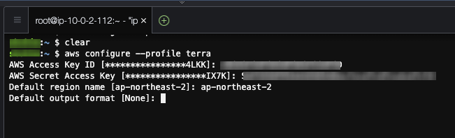

# 프로비저닝 환경 구성
Terraform / AWS CLI 를 설치 하고 AWS 클라우드를 프로비저닝 할 수 있는 환경을 구성 합니다.

<br>

## Terraform 프로비저닝을 위한 IAM 계정 추가 
먼저 관리 콘솔에 로그인하여 새로운 계정을 추가 합니다.    

- 본인이 소유한 계정이 `symple@your.mail` 이라면 `symple.api@your.mail` 의 이름으로 AWS 자격 증명 유형을 `액세스 키 – 프로그래밍 방식 액세스` 으로 생성 합니다.  


- 주요 태그 속성으로 "CreatedBy" 로 "Console" 로 "Team" 은 자신이 속한 팀 이름(예: "BTC") 라고 추가 합니다.  


- AccessKey 확인  
사용자 계정이 생성되면 access-key 를 확인 및 다운로드 할 수 있습니다.  
여기에서 발급된 access-key 를 기반으로 `symple.api@your.mail` 사용자로 AWS 클라우드를 액세스 하게 됩니다 .


<br>

## AWS CLI 설치 
[AWS CLI 설치](https://docs.aws.amazon.com/ko_kr/cli/latest/userguide/getting-started-install.html) 가이드를 따라 최신 버전의 CLI 를 설치 하고 버전을 확인 합니다. 

- AWS CLI 설치

```
cd /tmp/
curl "https://awscli.amazonaws.com/awscli-exe-linux-x86_64.zip" -o "awscliv2.zip"
unzip awscliv2.zip
sudo ./aws/install
```

- AWS CLI 버전 확인
```
aws --version 
```

<br>

## AWS Profile 설정
`aws configure --profile terra` 명령으로 `terra` 프로파일을 생성 합니다.   


```
# AWS CLI 로 현재 어카운트의 리전 (예: 서울)에 존재하는 vpc 목록을 확인 합니다. 
aws ec2 describe-vpcs --region ap-northeast-2 --query "Vpcs[].[ [Tags[?Key=='Name'].Value][0] ]" --output text --profile terra
```

<br>

## MFA 정책으로 임시 토큰을 발급 받는 경우

- [mfa.sh](./mfa.sh) 쉘 파일 참고 
```shell
cat <<'EOF' | > mfa.sh
#!/bin/bash

# Write MFA_ARN which is getting from IAM console under user security. (ex: "arn:aws:iam::1234567890:mfa/YOUR-IAM-MFA-ARN")
MFA_ARN="<YOUR_MFA_ARN_FROM_IAM_USER>"
PROFILE="default"
AWS_STS_PROFILE="sts"
AWS_STS_REGION="ap-northeast-2"

arg1=$1
if [ ! -z "$arg1" ]
then
  PROFILE="$arg1"
fi

echo "Usage: \n  mfa.sh \n  Or \n  mfa.sh <profile> # if not default profile"
echo "\n\n"

read -p 'Enter the MFA code : ' MFA_TOKEN

CRED_DATA=$(aws sts get-session-token --duration-seconds 36000 --serial-number ${MFA_ARN} --token-code ${MFA_TOKEN} --profile ${PROFILE})

AWS_ACCESS_KEY_ID=$(jq -r '.Credentials.AccessKeyId' <<< "${CRED_DATA}")
AWS_SECRET_ACCESS_KEY=$(jq -r '.Credentials.SecretAccessKey' <<< "${CRED_DATA}")
AWS_SESSION_TOKEN=$(jq -r '.Credentials.SessionToken' <<< "${CRED_DATA}")

aws configure set region ${AWS_STS_REGION} --profile ${AWS_STS_PROFILE}
aws configure set aws_access_key_id ${AWS_ACCESS_KEY_ID} --profile ${AWS_STS_PROFILE}
aws configure set aws_secret_access_key ${AWS_SECRET_ACCESS_KEY} --profile ${AWS_STS_PROFILE}
aws configure set aws_session_token ${AWS_SESSION_TOKEN} --profile ${AWS_STS_PROFILE}

echo "### Check access to AWS with 'sts' profile"
echo "aws sts get-caller-identity --profile sts"

EOF
```

- 쉘 스크림트 내용 중 `MFA_ARN` 환경 변수를 본인의 MFA ARN 을 설정 하여야 합니다.


만약 jq 프로그램이 설치되지 않았다면 설치 하도록 합니다.  
- [JQ 웹사이트 참고](https://stedolan.github.io/jq/)

```shell
# for ubuntu 
sudo apt-get install jq

# for MacOS
brew install jq
```


<br>

## Terraform 설치 

**Terraform**은 하위 호환성을 엄격하게 지키고 있지 않습니다. 그러므로 프로젝트 구성에 있어서 버전은 중요한 결정 요소중 하나 입니다.    
고객사마다 구성된 Terraform 프로젝트가 시기별로 다를 수 있고 이는 Terraform 버전이 다르다는 의미이기도 합니다.  
이런 상황에 효과적으로 대응하기위해 패키지 매니저를 통해 원하는 버전의 Terraform을 결정하여 프로젝트를 생성할 수 있도록 합니다.  

## [tfswitch](https://tfswitch.warrensbox.com/Install/) 패키지 매니저 설치 

```
# root 사용자로 전환
sudo su -

# tfswitch 패키지 매니저 설치 
curl -L https://raw.githubusercontent.com/warrensbox/terraform-switcher/release/install.sh | bash

# 원래 사용자 계정으로 전환 (ec2-user or ubuntu)
exit
```

## .bashrc 프로파일 구성
```
vi ~/.bashrc

# .bashrc 파일 하단에 기입 하도록 합니다.
export PATH="$PATH:$HOME/bin"

# .bashrc 파일을 저장 하였다면 아래 명령을 통해 새로운 프로파일 적용 합니다. 
source ~/.bashrc
```

## Terraform 버전 선택 및 설치
`tfswitch -l` 명령을 통해 원하는 Terraform 버전을 다운로드 받고 테라폼을 실행할 수 있습니다. 
```
tfswitch -l
```


## Terraform 프로젝트 테스트
```
mkdir -p ~/project/test
cd ~/project/test
```

### providers 정의 

**providers.tf** 파일 편집
```hcl
terraform {
  required_version = ">= 1.0.0, < 2.0.0"

  required_providers {
    aws = {
      source  = "hashicorp/aws"
      version = "> 4.22.0"
    }
  }
}

provider "aws" {
  profile = "terra"
  region  = "ap-northeast-2"
}
```

### 프로젝트 init 
```
terraform init 
```
아래와 같이 provider 가 버전 요구사항에 맞게 설치됨을 확인할 수 있습니다.  


