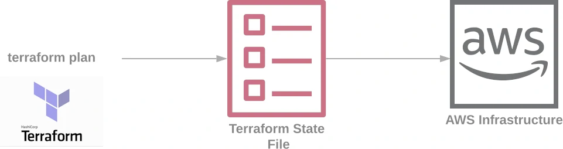
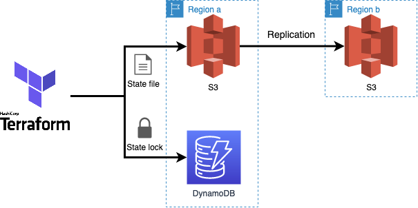
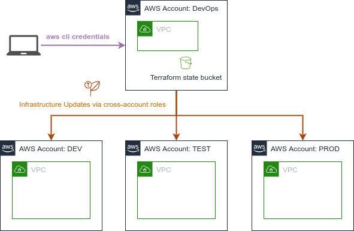
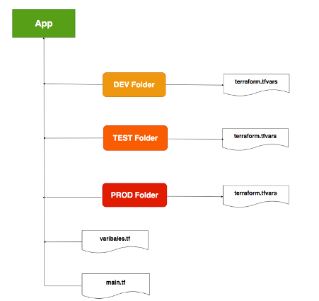

# Terraform State 소개

테라폼 상태 파일(Terraform state file)은 테라폼이 관리하는 인프라 리소스의 현재 상태를 반영한 파일입니다. 
이 파일은 테라폼이 생성한 리소스, 리소스 간의 종속성, 리소스 속성 등과 같은 정보를 포함하고 있습니다. 
상태 파일은 일반적으로 .tfstate 확장자를 가지며 JSON 혹은 HCL(HashiCorp Configuration Language) 형식으로 작성됩니다.

테라폼 상태 파일은 다음과 같은 주요 목적을 가지고 있습니다.

- 현재 인프라 상태 추적: 상태 파일은 현재 프로젝트의 인프라 상태를 추적합니다. 이 파일은 테라폼이 생성한 리소스의 정보와 속성을 포함하고 있어 테라폼이 인프라를 관리하는 데 필요한 모든 정보를 담고 있습니다.
- 리소스 관리 및 변경 추적: 상태 파일은 각 리소스의 현재 상태를 추적하여 변경 사항을 관리합니다. 테라폼은 이 파일을 사용하여 인프라 변경을 추적하고, 새로운 리소스를 생성하거나 기존 리소스를 업데이트 또는 삭제합니다.
- 스테이트 잠금 및 동시성 제어: 상태 파일은 동시에 여러 사용자나 프로세스가 인프라를 변경하지 못하도록 스테이트 잠금을 관리하는 데 사용됩니다. 이를 통해 여러 사용자가 동시에 동일한 인프라 리소스를 변경하려고 할 때 충돌을 방지하고, 안전한 변경을 보장할 수 있습니다.


<br>

## Terraform 명령어

Terraform 기본 명령어와 프로비저닝 흐름을 이해 합니다.

<br>

### terraform 버전 확인

terraform 버전을 확인 합니다. 참고로 terraform 은 하위 호환성을 지켜주지 않으므로 버전 정의는 아주 중요합니다.

```shell
terraform -version
```

### terraform --help

```shell
terraform --help

Usage: terraform [global options] <subcommand> [args]

The available commands for execution are listed below.
The primary workflow commands are given first, followed by
less common or more advanced commands.

Main commands:
  init          Prepare your working directory for other commands
  validate      Check whether the configuration is valid
  plan          Show changes required by the current configuration
  apply         Create or update infrastructure
  destroy       Destroy previously-created infrastructure

All other commands:
  console       Try Terraform expressions at an interactive command prompt
  fmt           Reformat your configuration in the standard style
  force-unlock  Release a stuck lock on the current workspace
  get           Install or upgrade remote Terraform modules
  graph         Generate a Graphviz graph of the steps in an operation
  import        Associate existing infrastructure with a Terraform resource
  login         Obtain and save credentials for a remote host
  logout        Remove locally-stored credentials for a remote host
  metadata      Metadata related commands
  output        Show output values from your root module
  providers     Show the providers required for this configuration
  refresh       Update the state to match remote systems
  show          Show the current state or a saved plan
  state         Advanced state management
  taint         Mark a resource instance as not fully functional
  test          Experimental support for module integration testing
  untaint       Remove the 'tainted' state from a resource instance
  version       Show the current Terraform version
  workspace     Workspace management

Global options (use these before the subcommand, if any):
  -chdir=DIR    Switch to a different working directory before executing the
                given subcommand.
  -help         Show this help output, or the help for a specified subcommand.
  -version      An alias for the "version" subcommand.
```

### terraform 주요 명령어

- terraform plan: 작성된 코드를 통해 REAL 인프라가 어떻게 적용 될 것인지 미리 계획을 보여 줍니다. 또한 작성된 코드의 오류가 없는지도 확인 합니다.

```shell
terraform plan 
```

<br>

- terraform apply: 명령을 통해 작성된 Code 를 REAL 인프라에 적용 합니다.

```shell
terraform apply  
```

<br>

- terraform destroy: 명령을 통해 현재 Code 에 대응하여 REAL 인프라에 구성된 모든 리소스를 제거 합니다.

```shell
terraform destroy  
```

<br>
<br>

## Terraform 상태 관리

terraform 프로비저닝 흐름은 다음과 같습니다.



### terraform code

Provider, Resource, Data Source, Output, Variable 을 통해 코드를 작성 합니다.

### terraform.tfstate

plan / apply 를 통해 코드가 REAL 인프라에 적용된 결과 상태를 저장 합니다.

### Real Infrastructure

AWS, AZure, GCP 와 같은 클라우드에 네트워크, 컴퓨팅 리소스, 소프트웨어 서비스가 구성된 가상의 데이터 센터 입니다.


<br>

## tfstate 로컬 관리

프로젝트의 Workspace 기준으로 REAL 인프라를 구성하고 여기에 대응하는 tfstate 상태 파일을 로컬 환경(PC)에서 관리 합니다. 공동 작업을 위해선 terraform code(*.tf) 뿐만 아니라
현재 REAL Infra 에 대응하는 최신의 terraform.tfstate 파일을 공유하여야 합니다.

```shell
Workspace
├── templates
│   └── MFAPolicy.json
├── main.tf
├── outputs.tf
├── providers.tf
├── terraform.tfstate
├── terraform.tfstate.backup
├── terraform.tfvars
└── variables.tf
```

<br>

[문제 풀이를 통해 생각해 봅시다.](./practice/handson.md)


<br>
<br>

## tfstate 리모트 관리 (Advanced)

### Remote 저장소 구성

- 구성 개요 



- [repository 구성 참고](./example/repository/)

  
- 프로젝트 레이아웃

```
.
├── lock                    Terraform 동시 프로비저닝 방지를 위한 DynamoDB Lock 테이블 구성
│   ├── main.tf
│   └── variables.tf
├── storage                 Terraform 상태 파일 저장을 위한 S3 구성 
│   ├── main.tf
│   └── variables.tf
├── main.tf
├── providers.tf
└── terraform.tfstate
```


- Deploy
```
cd lab-103/example/repository

# 프로젝트 초기화구성 
terraform init --upgrade

# 플랜 확인 
terraform plan

# 적용 
terraform apply

```

### Remote 저장소 Provider 구성 예시

```hcl
terraform {
  required_version = ">= 1.2.0, < 2.0.0"

  backend "s3" {
    dynamodb_table = "symple-terraform-lock"
    key            = "symple-dev/terraform.tfstate"
    acl            = "bucket-owner-full-control"
    bucket         = "symple-terraform-repo"
    encrypt        = true
    region         = "ap-northeast-2"
  }
}
```

- [테라폼 프로젝트 VPC 구성 예시](./example/simple/)


<br>

## tfstate 분할 관리  (Advanced)




서비스 운영 환경 구분은 Production, Stage, Development, Seoul, USA 등으로 할 수 있습니다.  
이렇게 구분 하는 단위로 우리는 `Environment` 또는 `Stack`이라고도 합니다.

<br> 

tfstate 상태 파일의 분할 관리 목적은 

1. 서비스 운영 환경을 격리화 하여 구분 짓고,
2. 각 환경의 의존성이 없이 독립적으로 운영 되고,
3. 대규모의 인프라를 블럭 단위로 결합 하는것과 같이 작은 단위로 관리 함으로써 문제를 최소화 하고 가독성을 높으며,
4. 동일한 코드를 통해 각 환경에 맞게 자동화 된 관리가 가능 하도록 설계에 반영 하는 것 입니다.  


### 프로젝트 구성 예시

테라폼 프로젝트를 아래와 같이 주요 구성 파일을 포함하여 간단하게 구성 할 수 있습니다.

```
symple
├── data.tf
├── main.tf
├── outputs.tf
├── providers.tf
├── terraform.tfvars
└── varibles.tf
```

또한 우리는 테라폼 명령을 통해 프로젝트 초기화 및 프로비저닝을 할 수 있습니다.

```bash
terraform init
terraform plan
terraform apply
terraform destory
```

<br>


### 프로젝트 폴더(모듈)을 통한 격리화


프로젝트 폴더를 통한 분할 관리는 각 환경에 맞는 디렉토리 구조에서 테라폼 코드 `*.tf` 와 `terraform.tfvars` 를 통해 REAL Infra 를 대상으로 프로비저닝 할 수 있습니다.




  
동일한 파일을 유지 관리하기 때문에 `main.tf` terraform `variables.tf` 명령을 실행할 때 환경에 따라 다른 변수를 전달해야 합니다.

예를 들어 세 가지 환경이 있는 경우 각각의 환경에 대한 프로비저닝을 하기 위해 다음과 같이 명령을 실행 하여야 합니다.

- **각 환경별 프로비저닝 ** 구성 예시
```shell
# Dev Environment
terraform plan --var-file="tfvars/environment/dev.tfvars" 

# QA Environment
terraform plan --var-file="tfvars/environment/qa.tfvars"

# Production Environment 
terraform plan --var-file="tfvars/environment/prod.tfvars"
```

<br>

#### 폴더 구성의 장점
- 코드 중복이 없습니다
- 리소스를 변경하고 싶다면 모든 환경에서 변경할 필요는 없습니다.

#### 폴더 구성의 단점
- 각 환경에서 리소스를 쉽게 추가하거나 제거할 수 없습니다.
- 동일한 파일을 다른 var 파일과 함께 사용하기 때문에 한 환경의 변경 사항은 다른 환경에 영향을 미칩니다.

<br>
<br>


### Workspace 를 통한 스택 관리

terraform Workspace 는 여러 상태를 단일 구성을 통해 관리 할 수 있는 기능 입니다.    
폴더 기준의 분할 관리와 거의 차이가 없어 보이지만 명확하게 환경을 지정해야 하고 상태 및 변수를 자동으로 관리합니다.    

아무것도 구성하지 않더라도 `default` 라는 Workspace 가 있습니다.

```shell
terraform workspace list
* default
```

<br>

새로운 workspace 추가는 `terraform workspace new` 명령어로 할 수 있습니다.  
```shell
terraform workspace new dev
terraform workspace new stg
terraform workspace new prd
```

`terraform workspace list` 명령어로 workspace 를 확인 할 수 있으며 `*` 는 현재 선택된 프로비저닝 타겟 환경 입니다.  
```shell
terraform workspace list
* default
  dev
  prd
  stg
```

`terraform workspace select` 명령어로 프로비저닝 워크스페이스를 'stg'로 변경해 봅시다.

```shell
# 타겟 워크스페이스 변경 
terraform workspace select stg
Switched to workspace "stg".

# 현재 프로비저닝 대상 타겟 워크스페이스 확인 
terraform workspace list
  default
  dev
  prd
* stg
```
