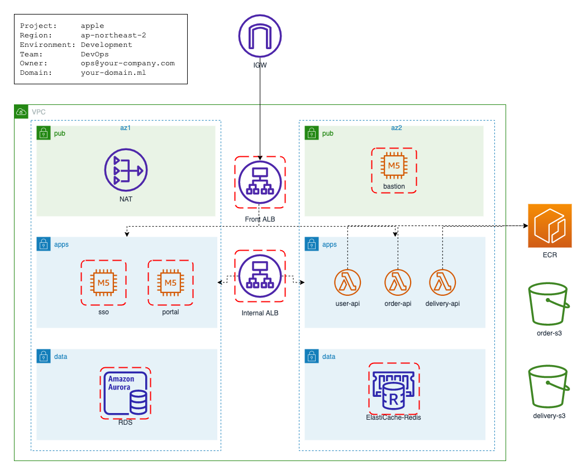

# apple 프로젝트 구현

고객은 E-커머스 서비스 `Apple` 을 클라우드 환경으로 구성 하길 원하며 다음과 같은 요구가 있습니다.

## 요구 사항

- 포탈을 통해 사용자에게 E 커머스의 다양한 서비스를 제공 하고 있습니다.
- Single Sign On 으로 통합 인증 서비스를 제공 합니다.
- 빠른 사용자 인증 및 액세스 권한을 위핸 Cache 서비스를 활용 하길 원합니다.
- 사용자 관리 / 상품 / 주문 / 배송 관리를 담당하는 백엔드 애플리케이션이 있습니다.
- 데이터는 정형 데이터베이스에 저장되길 원합니다.
- 로그와 같은 비정형 데이터는 S3 에 저장하고 필요할 때 분석하길 원합니다.
- 강력한 보안이 적용되길 원합니다.
- 애플리케이션의 안정적인 서비스 환경을 원합니다.
- 부하에 대응하는 탄력적인 확장이 가능하길 원합니다.

<br> 

## 솔루션즈 아키텍처 제안

고객 요구사항에 대응하는 솔루션즈 아키텍처 초안을 아래와 같이 제안 하였습니다.



<br>

## Hands-On

위 아키텍처를 위한 테라폼 프로젝트를 구성 합니다.

### Q1 - 프로젝트 레이아웃을 구성 하세요.

- `apple` 서비스 스택을 위한 테라폼 프로젝트의 디렉토리 레이아웃을 구성 하세요.
- README.md 파일을 통해 개발자가 이해하기 쉽도록 가이드 문서를 작성 하세요.

```
apple
...
└── README.md
```

<br>

### Q2 - VPC 를 구성 하세요.


- VPC 및 관련 네트워크 리소스를 구성 합니다.
- 리소스 이름은 프로젝트를 쉽게 식별 할 수 있어야 합니다.
- 리로스 참조 및 관리를 위해 필요로 하는 태깅 속성을 추가 합니다.
- VPC CIDR 블럭은 넉넉하게 65535 이하로 구성이 가능해야 합니다.
- AWS VPC 를 구성하며 DHCP 및 DNS 서비스를 할 수 있어야 합니다.
- VPC CIDR 블럭은 넉넉하게 65535 이하로 구성이 가능해야 합니다.
- 가용성을 위해 AZ 을 2개 이상 구성 하여야 합니다.
- 인터넷 사용자가 서비스를 제공 받을 수 있어야 합니다.
- 서비스를 위한 컴퓨팅 자원은 외부 접속으로부터 안전하게 보호되어야 합니다.

**[aws_vpc 리소스](https://registry.terraform.io/providers/hashicorp/aws/latest/docs/resources/vpc)**     
**[CIDR 계산기](https://www.ipaddressguide.com/cidr)**

<br>

### Q3 - Bastion 을 구성 하세요.


- AMI 는 ubuntu-20.04 기본 이미지 배포판으로 아키텍처는 x86_64 여야 합니다.
- variable validation 통해 인스턴스 타입은 t3.micro 및 t3.small 로만 구성을 할 수 있습니다.
- 관리 목적의 EC2 인스턴스로 인터넷을 통해 운영자만 접근이 가능하도록 보안을 강화 하여야 합니다.
- 볼륨 타입은 gp3 이며 10 GB 볼륨을 사용 합니다.
- Bastion EC2 는 필요에 따라 생성 및 제거 할 수 있으며, EC2 가 다시 생성되더라도 관리자는 고정된 IP 주소로 Bastion 에 접속이 가능해야 합니다.
- Bastion EC2 가 제거 되더라도 VPC 에 영향을 주어선 안됩니다.
- keypair 는 apple-keypair 로 사전에 등록되어 있어야 합니다.

**[aws_instance 리소스 참조](https://registry.terraform.io/providers/hashicorp/aws/latest/docs/resources/instance)**  
**[aws_security_group 리소스 참조](https://registry.terraform.io/providers/hashicorp/aws/latest/docs/resources/security_group)**  
**[aws_eip 리소스 참조](https://registry.terraform.io/providers/hashicorp/aws/latest/docs/resources/eip)**  
**[eip_association 리소스 참조](https://registry.terraform.io/providers/hashicorp/aws/latest/docs/resources/eip_association)**


- AMI 참조 Hint
```hcl
data "aws_ami" "ubuntu" {
  most_recent = true
  filter {
    name   = "name"
    values = ["ubuntu/images/hvm-ssd/ubuntu-focal-20.04-amd64-server-*"]
  }
  filter {
    name   = "virtualization-type"
    values = ["hvm"]
  }
  owners = ["099720109477"]
}
```

- EIP 구성 Hint

```hcl
# 관리 콘솔에서 EIP 를 할당하고 DataSource 를 통해 참조 합니다.
data "aws_eip" "bastion" {
  filter {
    name   = "_"
    values = ["_"]
  }
}

resource "aws_eip_association" "eip_assoc_bastion" {
  instance_id   = "<ec2_instance_id>"
  allocation_id = data.aws_eip.bastion.id
  depends_on    = [
    aws_instance.bastion
  ]
}
```

- KeyPair 참조 Hint

```hcl
# 관리 콘솔에서 KeyPair 를 생성하고 DataSource 를 통해 참조 합니다.
data "aws_key_pair" "bastion" {
  key_name = _
}

resource "aws_instance" "bastion" {
  #...
  key_name = data.aws_key_pair.bastion.key_name
  #...
}
```

<br>

### Q4 (Advanced) - 위와 같이 최신 AMI 로 Bastion 을 구성했을때 어떤 문제가 잇으며 이 문제를 최소화 하기 위해 어떻게 하면 될까요?    
현재 Bastion 은 아래와 같이 클라우드 관리를 위해 설정이 완료된 상태 입니다.    
- 보안을 위한 OS-Hardening 이 적용 되어 있습니다. 
- Bastion 을 액세스하는 Ops 담당자에게 역할 (admin, deverloper, viewer)로 업무를 처리할 수 있도록 계정 발급을 하였습니다.  
- 내부 서비스가 정상적인지 빠른 확인을 위해 App, RDS, Cache 서비스를 접속 생태를 확인할 수 있도록 설정이 되어 있습니다.  

**[linux-hardening-checklist 참조](https://github.com/trimstray/linux-hardening-checklist)**


<br>


### Q5 - Portal 서비스를 위한 Front-ALB 를 구성 하세요.  
- 인터넷 액세스가 되어야 합니다.
- Public Domain 을 발급 받아야 합니다.  
- Route 53 Public Hostzone 을 구성 하여야 합니다. 
- ACM 인증서를 발급 받아야 합니다.
- 443 리서너를 구성하고 보안을 위해 TLS(HTTPS) 암화화 통신을 적용 하여야 합니다. 
- 80 리스너를 구성하고 443 포트로 리-다이렉트 하여야 합니다. 


<br>


### Q6 - Portal 서비스용 EC2 애플리케이션 서비스를 구성 하세요.

- AMI 는 ubuntu-20.04 기본 이미지 배포판으로 아키텍처는 x86_64 여야 합니다.
- 인스턴스 타입은 선택 할 수 있으며 기본은 t3.medium 입니다.
- 인스턴스 시작과 동시에 nginx 서비스를 제공하며 80 포트로 서비스를 할 수 있어야 합니다. 
- hostname 또는 uri 경로를 통해 서비스를 제공 할 수 있어야 합니다.
- Front-ALB 에 서비스를 위한 타겟 그룹을 구성하고 80 포트는 health 체크를 할 수 있어야 합니다. 


<br>


### Q7 (Advanced) - API 서비를 제공하는 Lambda 애플리케이션을 구현 하세요.
- ECR 저장소를 구성하여야 합니다.
- IAM 롤을통해 필요한 권한을 부여 해야 합니다.
- Lambda 애플리케이션을 구현 하여야 합니다. 
- Backend ALB 를 통해 Lambda 애플리케이션이 연결 되어야 합니다.  
- Frontend ALB 를 통해 인터넷 사용자가 접근을 할 수 있어야 합니다.  

**[Lambda 애플리케이션 구성 참고](https://github.com/chiwoo-cloud-native/aws-alb-lambda-lotto)**


